# Current Database ER Diagram

_Generated: 2026-05-18 | Source: `prisma/schema.prisma`_

## Summary

The current Prisma schema defines **35 models** and **27 enums** on PostgreSQL.

The database is organized around five connected areas:

1. **Identity and CRM**: `User`, `Customer`, `Child`
2. **Booking and catalog**: `StudioDepartment`, `SessionType`, `PackageFamily`, `Package`, `Product`, configuration and pricing tables
3. **Operational workflow**: `Job`, `Booking`, `Order`, editing, production, add-ons, and order activity
4. **Finance and audit**: `FinancialCase`, `Invoice`, `Payment`, adjustments, allocations, document application, and audit logs
5. **Identifier generation**: `IdentifierSequence`

The authoritative workflow thread is now:

`Customer -> Job -> Booking -> Order`

Financial records hang off a required **`FinancialCase`**, which is currently **one-to-one with `Booking`** and can optionally also point to the canonical `Job`.

---

## Domain Map

### Identity and CRM

- `User`: studio staff, Clerk-linked through nullable unique `clerkId`
- `Customer`: customer root record
- `Child`: child profile owned by a customer

### Booking and catalog

- `StudioDepartment`
- `SessionType`
- `PackageFamily`
- `Package`
- `Product`
- `PackageItem`
- `SessionConfiguration`
- `SessionConfigurationOption`
- `SessionTypeExtraPhotoPricing`
- `BookingPackage`
- `BookingTheme`

### Operational workflow

- `Job`: canonical operational thread owner of `jobNumber`
- `Booking`
- `Order`
- `OrderPackage`
- `OrderPackageSessionConfigurationSelection`
- `EditingJob`
- `ProductionJob`
- `OrderAddOn`
- `OrderPackageItemUpgrade`
- `OrderActivity`

### Finance and audit

- `FinancialCase`
- `Invoice`
- `InvoiceLineItem`
- `InvoiceLockSnapshot`
- `Payment`
- `PaymentAllocation`
- `DocumentApplication`
- `AdjustmentWorkspace`
- `AdjustmentWorkspaceEvent`
- `AuditLog`

### Utilities

- `IdentifierSequence`

---

## ER Diagram

This diagram is intentionally relationship-first. It shows the current schema structure without trying to mirror every scalar column in Mermaid.

```mermaid
erDiagram
    User
    Customer
    Child
    FinancialCase
    Job
    StudioDepartment
    SessionType
    PackageFamily
    Package
    Product
    PackageItem
    SessionConfiguration
    SessionConfigurationOption
    SessionTypeExtraPhotoPricing
    Booking
    BookingPackage
    BookingTheme
    Order
    OrderPackage
    OrderPackageSessionConfigurationSelection
    EditingJob
    ProductionJob
    OrderActivity
    AuditLog
    OrderAddOn
    OrderPackageItemUpgrade
    Invoice
    InvoiceLineItem
    InvoiceLockSnapshot
    Payment
    PaymentAllocation
    DocumentApplication
    AdjustmentWorkspace
    AdjustmentWorkspaceEvent
    IdentifierSequence

    Customer ||--o{ Child : "has"
    Customer ||--o{ Job : "owns"
    Customer ||--o{ Booking : "has"
    Customer ||--o{ Order : "has (denormalized)"
    Customer ||--o{ FinancialCase : "has"
    Customer ||--o{ Invoice : "billed on"

    User ||--o{ Booking : "assigned photographer"
    User ||--o{ Job : "assigned photographer"
    User ||--o{ EditingJob : "assigned editor"
    User ||--o{ OrderActivity : "attributed to"
    User ||--o{ AuditLog : "acts in"
    User ||--o{ DocumentApplication : "applies"
    User ||--o{ AdjustmentWorkspace : "opens/owns"
    User ||--o{ AdjustmentWorkspaceEvent : "acts in"
    User ||--o{ Order : "delivery completed by"

    StudioDepartment ||--o{ SessionType : "owns"
    StudioDepartment ||--o{ Booking : "hosts"

    SessionType ||--o{ PackageFamily : "groups"
    SessionType ||--o{ SessionConfiguration : "configures"
    SessionType ||--o{ SessionTypeExtraPhotoPricing : "prices"
    SessionType ||--o{ BookingPackage : "used by"
    SessionType ||--o{ OrderPackage : "used by"

    PackageFamily ||--o{ Package : "contains"
    Package ||--o{ PackageItem : "contains"
    Package ||--o{ BookingPackage : "booked as"
    Package ||--o{ OrderPackage : "ordered as"

    Product ||--o{ PackageItem : "included in"
    Product ||--o{ OrderAddOn : "snapshotted in"
    Product o|--o{ SessionConfiguration : "linked product"

    SessionConfiguration ||--o{ SessionConfigurationOption : "offers"
    SessionConfiguration ||--o{ OrderPackageSessionConfigurationSelection : "selected in"
    SessionConfigurationOption o|--o{ OrderPackageSessionConfigurationSelection : "option chosen"

    Job ||--o| Booking : "anchors"
    Job ||--o| Order : "anchors"
    Job ||--o| EditingJob : "anchors"
    Job ||--o| ProductionJob : "anchors"
    Job ||--o{ FinancialCase : "linked to"
    Job ||--o{ Invoice : "linked to"
    Job ||--o{ Payment : "linked to"

    Booking ||--o| FinancialCase : "opens case for"
    Booking ||--o| Order : "generates"
    Booking ||--o{ BookingTheme : "has"
    Booking ||--o{ BookingPackage : "contains"
    Booking ||--o{ Invoice : "context for"

    FinancialCase ||--o{ Invoice : "owns"
    FinancialCase ||--o{ Payment : "owns"

    Order ||--o| EditingJob : "has"
    Order ||--o| ProductionJob : "has"
    Order ||--o{ OrderActivity : "logs"
    Order ||--o{ OrderAddOn : "has"
    Order ||--o{ OrderPackage : "has"
    Order ||--o{ OrderPackageItemUpgrade : "has"
    Order ||--o{ Invoice : "context for"
    Order ||--o{ AdjustmentWorkspace : "adjusted through"

    OrderPackage ||--o{ OrderAddOn : "scopes"
    OrderPackage ||--o{ OrderPackageItemUpgrade : "upgrades"
    OrderPackage ||--o{ OrderPackageSessionConfigurationSelection : "stores"

    PackageItem ||--o{ OrderPackageItemUpgrade : "upgraded from"
    OrderAddOn o|--o{ OrderPackageSessionConfigurationSelection : "created from"

    Invoice ||--o{ InvoiceLineItem : "contains"
    Invoice ||--o{ InvoiceLockSnapshot : "snapshotted as"
    Invoice ||--o{ Payment : "receives"
    Invoice ||--o{ PaymentAllocation : "allocated by"
    Invoice ||--o{ DocumentApplication : "source/target"
    Invoice ||--o{ AdjustmentWorkspace : "parent/finalized in"
    Invoice ||--o{ Invoice : "adjusts"

    Payment ||--o| PaymentAllocation : "allocates to"
    Payment ||--o{ Payment : "refund chain"

    InvoiceLineItem o|--o{ DocumentApplication : "target line"

    AdjustmentWorkspace ||--o{ AdjustmentWorkspaceEvent : "records"
```

---

## Main Relationships

- **`Customer -> Job`**: `Job` is the canonical operational owner of `jobNumber` and the root thread for downstream order/editing/production work.
- **`Job -> Booking`**: `Booking.jobId` is nullable but unique, so the schema supports at most one booking per job while still allowing transitional nulls.
- **`Booking -> FinancialCase`**: `FinancialCase.bookingId` is required and unique. Today that makes the financial case effectively one-per-booking.
- **`Booking -> Order`**: `Order.bookingId` is required and unique, so an order is a one-to-one downstream artifact of a booking.
- **`Order.customerId`**: this is an intentional denormalization of `Booking.customerId` to support direct customer-scoped order queries.
- **`BookingPackage` and `OrderPackage`**: packages are no longer a single FK on booking/order. Both stages can hold structured package rows tied to a `SessionType`.
- **`SessionConfiguration` stack**: configurable session options are modeled explicitly through `SessionConfiguration`, `SessionConfigurationOption`, and `OrderPackageSessionConfigurationSelection`, including snapshot fields so the order keeps pricing/config state even if catalog data changes later.
- **`OrderAddOn`**: add-ons are now structured rows tied to `Product`, optionally scoped to an `OrderPackage`.
- **`OrderPackageItemUpgrade`**: package deliverable upgrades are explicit rows tied back to the original `PackageItem`.
- **`EditingJob` and `ProductionJob`**: both are one-to-one with `Order` and one-to-one with `Job`.
- **`FinancialCase -> Invoice` and `FinancialCase -> Payment`**: finance is grouped under a case, not directly under booking or order alone.
- **`Payment -> Invoice`**: the relation uses the composite target `[invoiceId, financialCaseId] -> Invoice[id, financialCaseId]`, which ensures the payment and invoice stay inside the same financial case.
- **`PaymentAllocation`**: currently each payment can have at most one allocation because `paymentId` is unique in this table.
- **`Invoice -> Invoice`**: invoices can form parent/adjustment chains through `parentInvoiceId`.
- **`AdjustmentWorkspace`**: adjustments are tracked as a workspace attached to both a parent invoice and an order, with optional linkage to the finalized adjustment invoice.
- **`DocumentApplication`**: invoice documents can be applied from one invoice to another and optionally to a specific target line item.

---

## Current Model Notes

### Identity

- `User.clerkId` is nullable and unique.
- `User` is used for photographer assignment, editing assignment, delivery attribution, audit actions, document application attribution, and adjustment workspace ownership/events.

### Booking and catalog

- `SessionType` belongs to a `StudioDepartment`.
- `PackageFamily` belongs to a `SessionType`; `Package` belongs to a `PackageFamily`.
- `PackageItem` is the package-to-product join with `priceSnapshot` and `quantity`.
- `SessionTypeExtraPhotoPricing` is unique per `(sessionTypeId, mediaType)`.
- `BookingPackage` is the current booking-time package structure; `@@unique([bookingId, packageId])`.

### Orders and workflow

- `Order.publicId` is required and unique.
- `Order.jobId` and `Order.bookingId` are both required and unique.
- `Order.addOns` JSON still exists, but structured `OrderAddOn` rows are the relational source of truth.
- `Order.refundPending` exists as a mapped boolean column `refund_pending`.
- `OrderPackage` stores original/final package price snapshots, selected photo count, and extra photo counts.
- `OrderPackageSessionConfigurationSelection` stores both live references and immutable snapshot fields for pricing/configuration behavior.

### Finance

- `Invoice.financialCaseId` is required.
- `Invoice.jobId`, `Invoice.jobNumber`, `Invoice.orderId`, and `Invoice.bookingId` are all optional contextual links.
- `Invoice.invoiceSeq` is backed by the PostgreSQL sequence `invoice_number_seq`.
- `InvoiceLockSnapshot` stores a frozen financial/document snapshot when an invoice is locked.
- `Payment.direction` supports both inbound and outbound money flow.
- `Payment.refundOfPaymentId` enables refund chains through a self-relation.
- `DocumentApplication` can optionally point to `targetInvoiceLineId`.

### Audit and utilities

- `AuditLog` stores structured `before`, `after`, and `context` JSON.
- `IdentifierSequence` now uses a composite primary key: `scope + year + kind`.

---

## Enums in Active Use

The schema currently defines these enum groups:

- Staff and customer: `UserRole`, `CustomerStatus`
- Booking and fulfillment: `BookingStatus`, `OrderStatus`, `OrderSelectionStatus`, `OrderEditingStatus`, `OrderProductionStatus`, `OrderProductionSectionStatus`, `OrderDeliveryStatus`
- Invoicing and payments: `InvoiceStatus`, `InvoiceType`, `InvoiceLineType`, `PaymentMethod`, `PaymentType`, `PaymentDirection`
- Catalog and order metadata: `ProductCategory`, `MediaType`, `OrderEntityKind`, `OrderActivityType`
- Audit and configuration: `AuditEntityType`, `AuditAction`, `SessionConfigurationInputType`, `SessionConfigurationPricingMode`, `SessionConfigurationFinancialBehavior`, `SessionConfigurationCounterPricingMode`
- Adjustment workflow: `AdjustmentWorkspaceStatus`, `AdjustmentWorkspaceEventType`

---

## Legacy or Compatibility Fields Still Present

- `Booking.publicId`, `Booking.jobNumber`, and `Booking.jobId` are all nullable, reflecting transitional compatibility.
- `Order.addOns` JSON remains in the schema, but relational add-ons live in `OrderAddOn`.
- `Order.deliveryCompletedBy` still exists as a string fallback alongside `deliveryCompletedById`.
- `Invoice.jobNumber` and `Payment.jobNumber` still exist as optional string references even though `jobId`/`financialCaseId` now carry the stronger relational linkage.

---

## Authoritative Reference

For exact field-level truth, use `prisma/schema.prisma`.
This document is now aligned to that file as of **2026-05-18**.
