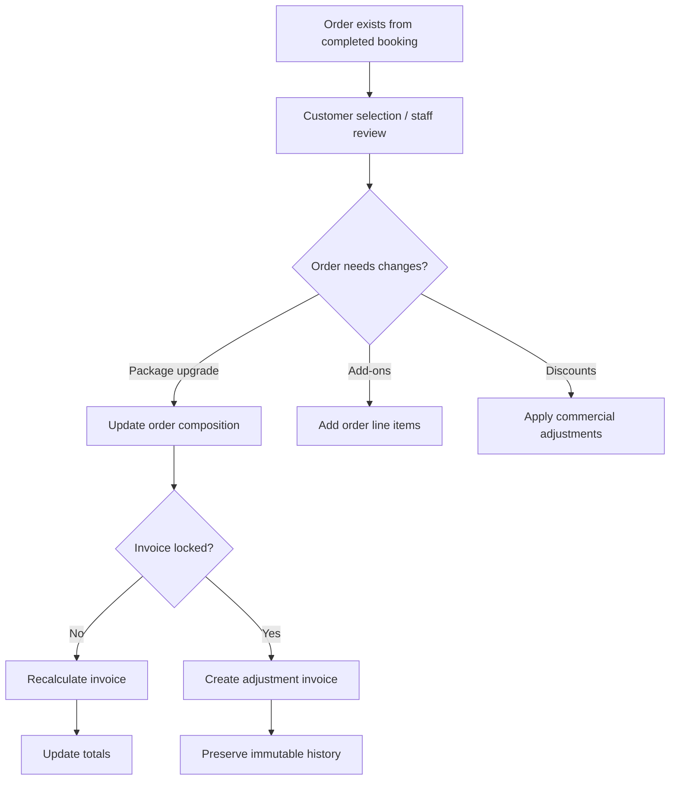

# Studio OS — POS / Commercial Workspace Architecture Review
**Date:** 2026-05-11

---

# Purpose

This document consolidates:

- business owner feedback
- package pricing discoveries
- POS architecture direction
- workflow discussions
- operational UX observations
- visual design direction
- financial safety concerns

The goal is to use this document as a discussion/reference file before creating:
- database changes
- architecture refactors
- unit feature specs
- workflow implementation specs

This is NOT a final implementation plan.

This is a strategic architecture + UX direction review.

---

# Core Discovery

Studio OS is NOT:
- traditional e-commerce
- inventory cart software
- Shopify-style checkout

Studio OS is evolving into:

# Service Studio Commercial Workflow Software

The workflow is:
- package-centric
- consultation-driven
- customizable
- operationally flexible
- financially controlled

This distinction is extremely important.

---

# Major Architectural Discovery

Packages are NOT:
- immutable financial entities
- strict SKU bundles
- summed product carts

Packages ARE:
- commercial bundle templates
- operational deliverable templates
- editable sales starting points

This changes:
- pricing architecture
- invoice logic
- POS behavior
- order composition
- workflow sequencing

---

# Package Pricing Model Discovery

The studio clarified:

- albums retain canonical prices globally
- standalone add-ons use canonical prices
- upgrades use actual product price differences
- package totals differ because the package applies a bundle adjustment

Example:

| Item | Canonical Price |
|---|---|
| Premium Album | 80 KD |
| Canvas | 30 KD |
| 40 Photos | 40 KD |
| Raw Total | 150 KD |

Package marketed as:
120 KD

Therefore:

```text
Package Adjustment = -30 KD
```

Final Formula:

```text
Final Package Price =
Raw Product Total + Package Adjustment
```

---

# Critical Pricing Rule

The package adjustment belongs to:
- the bundle itself

NOT:
- individual products

This is essential.

This allows:
- album upgrades
- package upgrades
- replacements
- add-ons
- invoice recalculation

to behave naturally.

---

# Upgrade Logic

Example:

Included:
- Premium Album = 80 KD

Customer upgrades to:
- Luxury Album = 110 KD

Upgrade Charge:
+30 KD

The package adjustment remains unchanged.

This was identified as:
- the correct
- natural
- scalable

pricing behavior.

---

# Key Architecture Separation

## Operational / UI View

Employees think in:
- albums
- canvases
- edited photos
- deliverables
- package upgrades
- customer requests

The package visually behaves like:
- editable deliverables

---

## Financial / Accounting View

Accounting thinks in:
- line items
- bundle adjustments
- invoice totals
- immutable snapshots
- payment balances

Therefore:

# UI composition and financial composition are separate concepts.

This separation is critical.

---

# Package Template vs Order Composition

Packages should act as:

# reusable commercial templates

NOT:
- transactional entities

Recommended flow:

```text
Package Template
    ↓
Copied Into Mutable Order Composition
    ↓
Employee Modifications
    ↓
Invoice Snapshot
    ↓
Immutable Financial Record
```

Employees modify:
- the ORDER composition

NOT:
- the original package definition

This supports:
- customizations
- negotiated sales
- replacements
- upgrades
- add-ons

without corrupting package templates.

---

# Recommended Conceptual Structure

## Package

```text
Package
├── Included Items
├── Raw Calculated Subtotal
├── Package Adjustment
└── Final Package Price
```

---

## Order

```text
Order
├── Copied Package Composition
├── Editable Deliverables
├── Standalone Add-ons
├── Commercial Adjustments
├── Pricing Snapshots
└── Invoice Calculations
```

---

# Final Order Pricing Formula

```text
Final Order Total =
Current Package Composition
+ Package Bundle Adjustment
+ Standalone Add-ons
+ Manual Discounts / Adjustments
```

---

# Historical Financial Snapshot Rule

Historical invoices/orders must NEVER dynamically recalculate from future product pricing changes.

When finalized:
the system must snapshot:
- product prices
- quantities
- package adjustments
- totals
- discounts

Otherwise:
future pricing changes would alter historical invoices.

This would break:
- accounting integrity
- reporting integrity
- auditability

---

# Package Upgrade Behavior

Package upgrades should:

Replace:
- current package composition

With:
- new package template composition

Then:
- recalculate totals
- apply new package adjustment
- preserve standalone add-ons where appropriate

Example:

```text
Silver Package
    ↓ Upgrade
Gold Package
```

This should behave naturally without manual line rebuilding.

---

# Standalone Add-On Behavior

Standalone add-ons:
- are NOT part of package adjustments
- use canonical standalone prices
- remain separate commercial line items

Examples:
- extra album
- extra canvas
- extra prints
- extra edited photos
- acrylic frame
- USB
- thank-you cards

---

# Important Workflow Discovery

The old system revealed an important operational pattern:

Employees heavily rely on:
- visible action buttons
- quick-add flows
- repetitive operational speed
- visual package editing
- direct modification actions

Even though the old system UI is outdated,
its workflow ergonomics are strong.

Important UX observations:
- Add Package
- Add Album
- Add Canvas
- Add Extras
- Add Other

are all:
- immediately visible
- operationally obvious
- one-click actions

This is important and should NOT be lost in modernization.

---

# Major POS UX Direction

The earlier mockup was too:
- ERP-like
- admin-dashboard-like
- form-heavy

The newer direction is much stronger.

The POS should feel more like:
- Apple Store configurator
- modern restaurant POS
- visual product composer
- consultation workspace

NOT:
- accounting software

---

# Recommended POS Philosophy

The POS page is NOT:
- a simple checkout page
- an invoice editor
- a cart screen

It becomes:

# Commercial Order Workspace

This page becomes the canonical place where:
- the commercial agreement is constructed.

---

# Recommended POS Layout Direction

## 1. Package Composition Area

Visual deliverables section.

Should visually show:
- included albums
- edited photos
- canvases
- digital items
- extras

Each item should have:
- image preview
- quick replace button
- quantity editor
- upgrade button

This area should feel:
- visual
- touch-friendly
- operational

NOT:
- accounting-heavy

---

## 2. Add / Replace Action Area

Very important discovery from old system UX.

Large visible action buttons:

- Add Album
- Add Canvas
- Add Prints
- Add Extras
- Add Digital
- Replace Item
- Upgrade Package

These actions should be:
- always visible
- fast-access
- operationally obvious

This likely becomes one of the most-used areas in the system.

---

## 3. Add-On Marketplace Section

Visual horizontal cards:
- extra photos
- acrylic frames
- mini albums
- thank-you cards
- extra canvases

One-click add behavior.

This should feel:
- fast
- visual
- consultation-oriented

---

## 4. Commercial Adjustment Area

Separate from deliverables.

This section handles:
- package adjustment visibility
- manual discounts
- upgrade deltas
- financial overrides

Example:

```text
Raw Deliverables Total: 150 KD
Package Adjustment: -30 KD
```

Then:

```text
Album Upgrade: +30 KD
Extra Canvas: +15 KD
Discount: -10 KD
```

This separation is VERY important.

Do NOT hide bundle pricing inside fake product pricing.

---

## 5. Financial Summary Sidebar

Separate accounting-oriented section.

Contains:
- subtotal
- adjustments
- paid amount
- remaining balance
- invoice status

This area should feel:
- trustworthy
- locked
- accounting-focused

Different tone from the editable composition area.

---

## 6. Workflow & Approval Area

This is where anti-fraud architecture starts integrating.

Examples:
- manager approval required
- invoice already partially paid
- discount exceeds threshold
- removing paid deliverable
- locked invoice modification
- refund required

This should become:
- operational safety layer
- approval checkpoint
- accounting protection surface

NOT hidden backend-only logic.

---

# Workflow Direction

Recommended future workflow:

```text
Booking
    ↓
Order Created
    ↓
Customer Selection
    ↓
Open Commercial Workspace (POS)
    ↓
Finalize Commercial Agreement
    ↓
Generate Invoice Snapshot
    ↓
Collect Payment
    ↓
Unlock Editing Workflow
```

---

# Payment Timing Discovery

Business owner clarified:

The current flow is incorrect if:
- payment occurs before final selections/upgrades

Operationally:
the final payable amount often does not exist yet.

Therefore:

Payment collection should occur AFTER:
- package selection
- upgrades
- add-ons
- adjustments

This aligns with:
- real studio operations
- financial correctness
- anti-fraud controls

---

# Important Financial Safety Discovery

The business owner raised a major concern:

Employees could:
- modify invoices after payment
- remove deliverables
- reduce totals
- keep the difference

Activity logs alone are NOT enough.

Therefore:

The system requires:
- immutable financial history
- approval workflows
- invoice locking
- visible financial adjustments
- accountant visibility

---

# Important Invoice Rules

Unlocked invoices:
- may recalculate

Locked/finalized invoices:
- must NEVER silently mutate

Instead:
- create adjustment invoices
- preserve original invoice
- preserve payment history

---

# Existing Workflow Direction Already Identified

Current proposed architecture already points toward:



The current direction is already evolving correctly toward:
- immutable financial records
- adjustment invoice architecture
- operational safety

---

# Important Future Concepts

The system is evolving beyond simple CRUD.

Strong recommendation:
eventually introduce explicit concepts for:

- Deliverable Line
- Commercial Adjustment
- Financial Snapshot
- Approval Request
- Upgrade Event

instead of overloading:
- Order
- AddOn
- Invoice

to handle everything.

---

# Final Strategic Conclusion

Studio OS is evolving into:

# Operational + Commercial + Financial Workflow Software

The correct long-term direction appears to be:

1. Canonical product pricing
2. Bundle adjustment architecture
3. Mutable order compositions
4. Commercial workspace POS flow
5. Snapshot-based invoice history
6. Approval/authorization workflows
7. Adjustment invoice architecture
8. Operationally visual UX
9. Consultation-driven order editing
10. Financial immutability after finalization

This direction was identified as:
- operationally realistic
- financially safer
- more scalable
- more maintainable
- better aligned with real photography studio workflows