# Studio OS Centralization Plan — Current State vs Target State

Generated: 2026-05-19  
Source: `context/reviews/centralization-inventory.md`

---

## 1. Executive Summary

Studio OS is not failing because the backend has no structure. The opposite is true: the write-side service layer is already strong in key areas like invoices, payments, adjustment workspace, refunds, and session-configuration pricing.

The main risk is the **read/display layer**:

- different pages load different subsets of the same business truth;
- some React components calculate totals locally;
- some tabs use old invoice/order models while other areas use FinancialCase-aware models;
- locked order composition, financial summaries, and workflow status affordances are not always generated from one canonical read model.

The target architecture should keep the existing service-owned write logic, but add centralized **read models / view models** that every page consumes.

---

## 2. Simple Diagnosis

| Area | Current State | Risk | Target State |
|---|---|---:|---|
| Invoice/payment writes | Mostly centralized | Low | Keep as-is |
| Financial summaries | Partially centralized, partly duplicated | High | One FinancialCase-aware summary service |
| Order Details page | Many separate loaders stitched in page | High | One `getOrderDetailsView(orderId)` orchestrator |
| POS composition | Shared services + duplicated UI preview math | Medium | One composition view model |
| Locked vs unlocked behavior | Guards exist, but UI policies/messages scattered | High | One edit-mode policy builder |
| Workflow status/actions | Transition rules exist, UI availability scattered | Medium-high | Workflow policy builders |
| Money formatting | Duplicated | Medium | One formatter; no parsing formatted strings |

---

## 3. Current State — Scattered Read Models

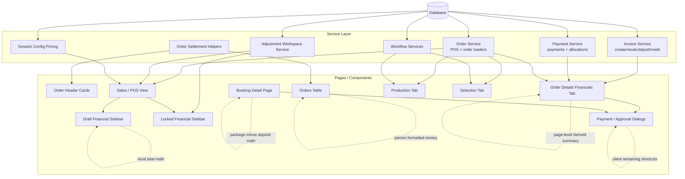

### What this means

The backend services are useful, but the UI is still doing too much interpretation. Some pages are not simply displaying a canonical answer; they are reconstructing the answer from different pieces.

That is why one page can look correct while another page becomes stale.

---

## 4. Target State — Canonical Read Models

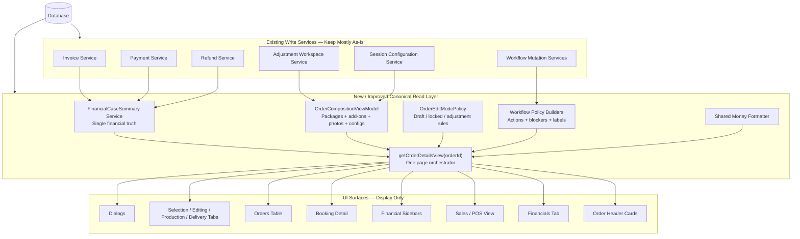

### Target principle

Pages should not answer business questions. They should ask one canonical service and render the result.

Instead of:

```ts
// page/component calculates totals from partial invoice/order rows
```

Prefer:

```ts
const view = await getOrderDetailsView(orderId);
```

Then the UI renders:

```ts
view.financial.summary.remainingAmount
view.composition.packageLines
view.workflow.delivery.availableActions
view.editMode.blockedReason
```

---

## 5. Current vs Target Financial Flow

### Current Financial Display Problem

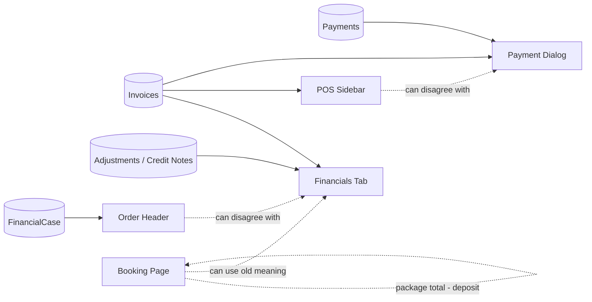

### Target Financial Display Flow

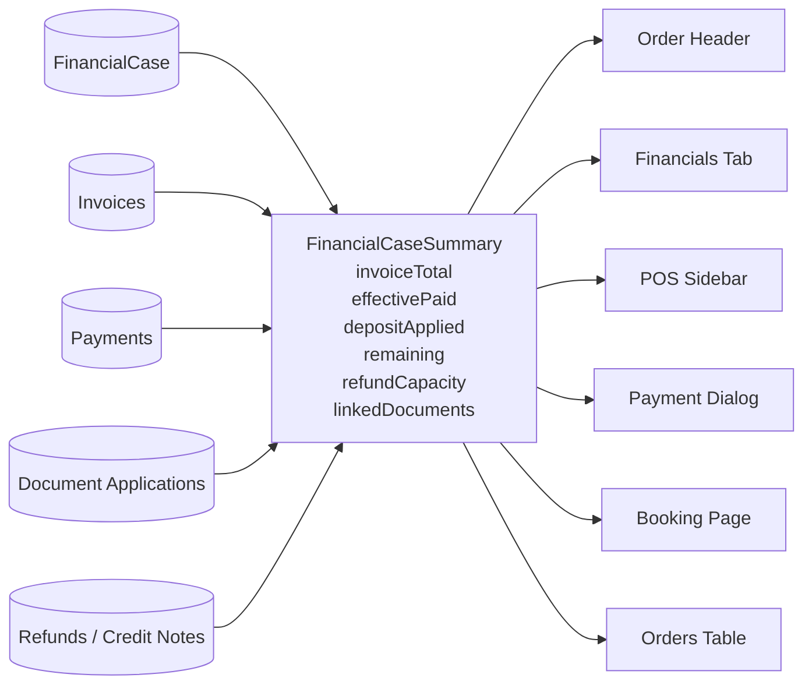

### Financial rule

There should be one place that answers:

- What is the customer total?
- What has been paid?
- What is remaining?
- What deposit was applied?
- What adjustment documents exist?
- Is there overpayment/refund capacity?
- What should the UI payment badge say?

---

## 6. Current vs Target Order Details Page

### Current Order Details Page

```mermaid
flowchart TD
  Page[app/orders/[orderId]/page.tsx]

  Hub[getOrderHubById]
  Selection[getOrderSelectionWorkflowById]
  Editing[getOrderEditingWorkflowById]
  Production[getOrderProductionWorkflowById]
  Delivery[getOrderDeliveryWorkflowById]
  POS[getPOSWorkspace]
  Docs[getLinkedFinancialDocumentsForOrder]

  Header[Header]
  Overview[Overview Tab]
  SelectionTab[Selection Tab]
  EditingTab[Editing Tab]
  ProductionTab[Production Tab]
  DeliveryTab[Delivery Tab]
  FinancialsTab[Financials Tab]

  Page --> Hub
  Page --> Selection
  Page --> Editing
  Page --> Production
  Page --> Delivery
  Page --> POS
  Page --> Docs

  Hub --> Header
  Hub --> Overview
  Selection --> SelectionTab
  Editing --> EditingTab
  Production --> ProductionTab
  Delivery --> DeliveryTab
  POS --> FinancialsTab
  Docs --> FinancialsTab

  Header -.may use different financial truth.-> FinancialsTab
  Overview -.may use old composition.-> ProductionTab
```

### Target Order Details Page

```mermaid
flowchart TD
  Page[app/orders/[orderId]/page.tsx]

  View[getOrderDetailsView(orderId)]

  Financial[FinancialCaseSummary]
  Composition[OrderCompositionViewModel]
  Workflow[Workflow Policies]
  EditMode[Edit Mode Policy]

  Header[Header]
  Overview[Overview Tab]
  SelectionTab[Selection Tab]
  EditingTab[Editing Tab]
  ProductionTab[Production Tab]
  DeliveryTab[Delivery Tab]
  FinancialsTab[Financials Tab]

  Financial --> View
  Composition --> View
  Workflow --> View
  EditMode --> View

  Page --> View

  View --> Header
  View --> Overview
  View --> SelectionTab
  View --> EditingTab
  View --> ProductionTab
  View --> DeliveryTab
  View --> FinancialsTab
```

### Order Details rule

The page should orchestrate layout, not business truth.

---

## 7. Composition State — Draft, Locked, Adjustment

### Current Composition Risk

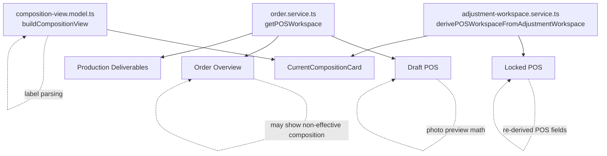

### Target Composition Read Model

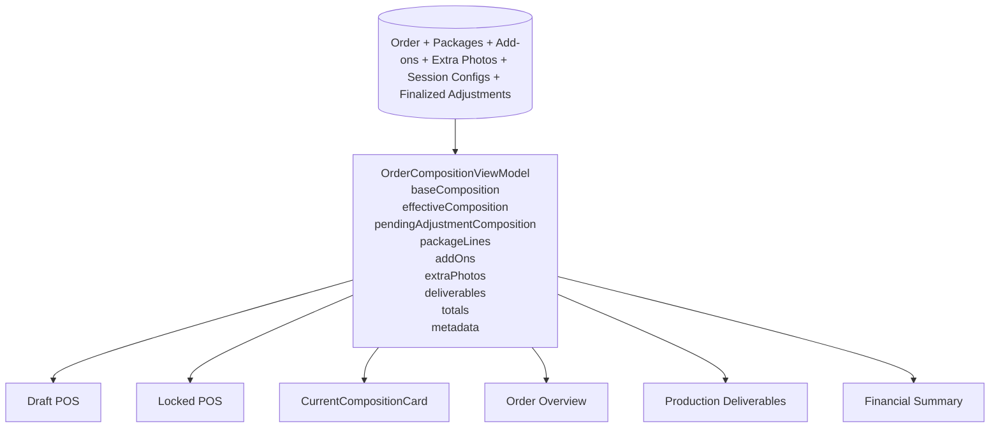

### Composition rule

Do not make each tab rediscover what the order contains. One model should describe what the customer owns operationally.

---

## 8. Edit Mode Policy

### Current Problem

Locked/draft/adjustment behavior is partly service-guarded, but UI routing, blocked messages, notices, and allowed actions are repeated.

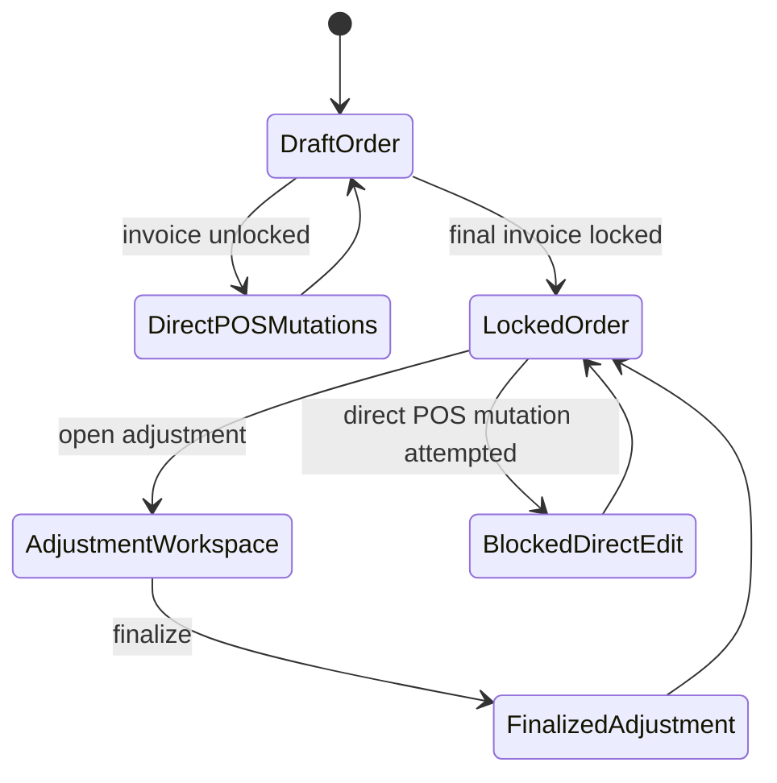

### Target Policy Builder

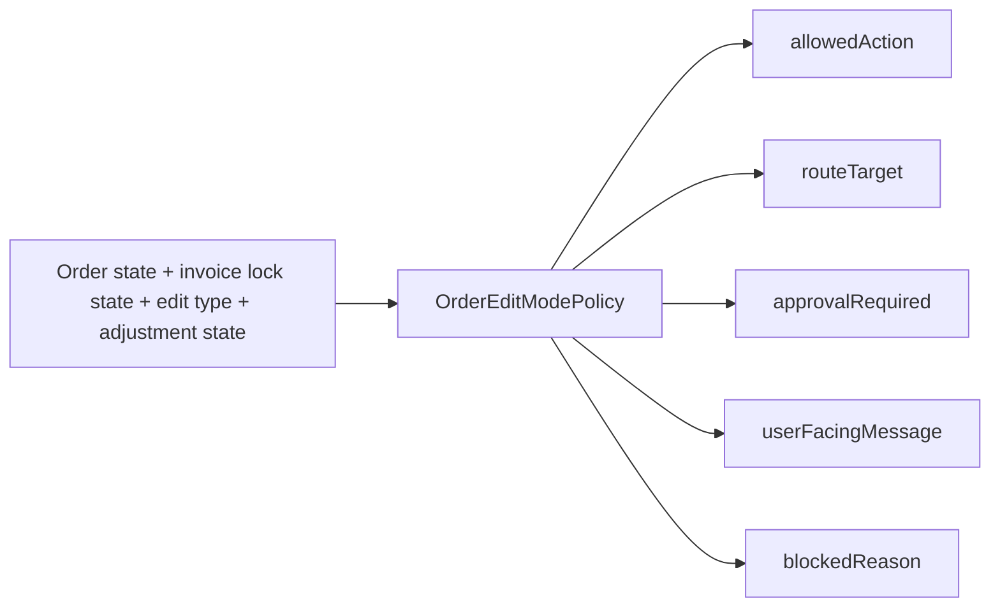

Example output shape:

```ts
export type OrderEditModePolicy = {
  mode: "draft" | "locked" | "adjustment";
  canEditDirectly: boolean;
  shouldOpenAdjustmentWorkspace: boolean;
  requiresManagerApproval: boolean;
  blockedReason?: string;
  routeTarget?: string;
};
```

---

## 9. Workflow Policy Target

### Current State

Workflow transitions exist, but components still encode action availability and labels.

### Target State

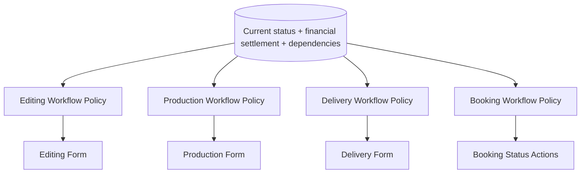

Each policy should return:

- available actions;
- blocked actions;
- reason messages;
- required dependencies;
- next status labels;
- whether manager override is needed.

---

## 10. Recommended Refactor Roadmap

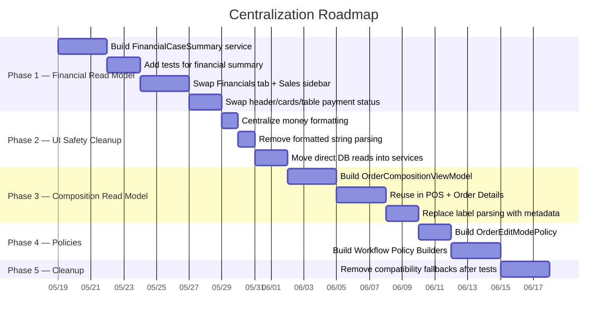

Dates are placeholders. The important part is the order, not the exact duration.

---

## 11. Priority Matrix

| Priority | Refactor Target | Why First? | Risk Reduced |
|---:|---|---|---|
| 1 | `FinancialCaseSummary` read service | Fixes the most visible truth mismatch | High |
| 2 | Shared Order Details financial derivation | Removes header/tab/sidebar disagreements | High |
| 3 | FinancialCase-aware order payment status | Prevents stale badges and table status | High |
| 4 | Shared money formatter | Simple, safe cleanup | Medium |
| 5 | Remove UI string parsing | Prevents fragile display logic | Medium |
| 6 | Move direct DB reads from actions/pages | Restores service-only boundary | Medium |
| 7 | `OrderCompositionViewModel` | Makes POS/order tabs agree on owned items | Medium-high |
| 8 | Edit mode policy | Makes locked/draft/adjustment behavior consistent | High |
| 9 | Workflow policy builders | Prevents UI action drift | Medium-high |
| 10 | Remove compatibility fallbacks | Only after tests/backfill prove safe | Medium |

---

## 12. What To Keep Stable For Now

Do **not** start by rewriting these:

- invoice write service;
- payment allocation service;
- refund service;
- credit-note capacity formulas;
- adjustment workspace write/finalize flow;
- Prisma schema;
- workflow status enums;
- FinancialCase fallback reads.

These areas either already work or are too risky to change before read models are centralized.

---

## 13. Suggested Feature Specs

### Spec A — Canonical FinancialCase Summary Read Model

Goal: Create one read-only financial summary service used by order header, order table, financial tab, sales sidebar, and payment dialogs.

Acceptance criteria:

- no write behavior changes;
- summary includes customer total, paid, remaining, deposits, adjustments, credits, refunds, linked documents;
- existing financial tests still pass;
- Financials tab and Sales sidebar use the same helper;
- discrepancy logging remains temporarily until all consumers are migrated.

---

### Spec B — Order Details View Orchestrator

Goal: Create `getOrderDetailsView(orderId)` that composes canonical financial, composition, workflow, and policy DTOs.

Acceptance criteria:

- `app/orders/[orderId]/page.tsx` becomes mostly layout orchestration;
- page tabs consume section DTOs from one view model;
- no tab performs independent financial/package/payment derivation;
- old loaders can remain internally, but not directly stitched in the page.

---

### Spec C — Order Composition View Model

Goal: Centralize effective order composition across draft POS, locked POS, adjustment workspace, overview, production, and current composition card.

Acceptance criteria:

- one model exposes packages, item upgrades, add-ons, extra photos, session configurations, deliverables, and totals;
- draft and locked modes consume the same shape where possible;
- label parsing is replaced with structured metadata where feasible;
- existing POS behavior remains unchanged.

---

### Spec D — Edit Mode + Workflow Policies

Goal: Centralize allowed actions, blocked messages, approval requirements, and route targets.

Acceptance criteria:

- UI components stop hardcoding locked/draft/adjustment notices;
- workflow forms receive available actions from policy builders;
- service guards remain authoritative;
- policy output is tested with common states.

---

## 14. Final Target Mental Model

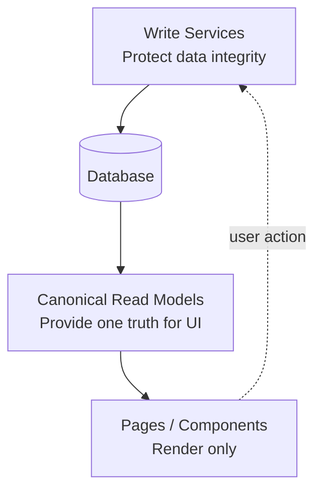

The goal is not to make the app smaller. The goal is to make it safer:

- one write path for mutations;
- one read model for display;
- one policy layer for allowed actions;
- dumb UI components that cannot accidentally invent a different truth.

